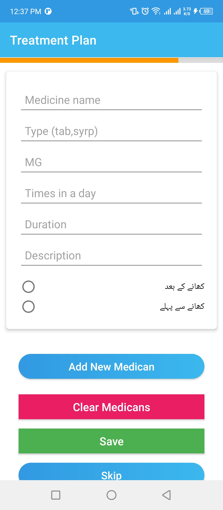
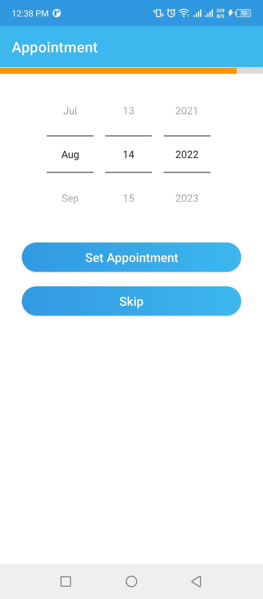

# Dentist IMS System
A complete mis system for a dentist to manage their patient record, developed in Android Java and Sqlite

   
     
       
         
          
     
       
         
          
     
       
         

